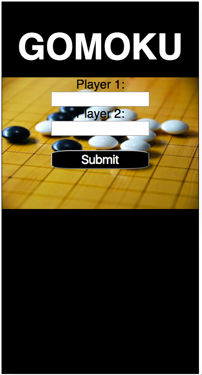
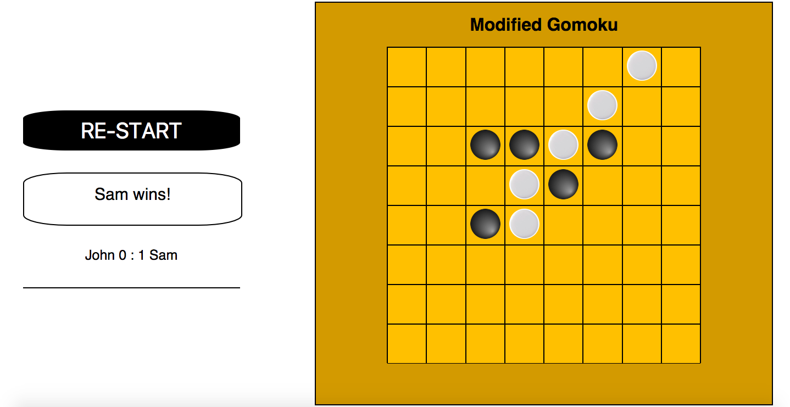

***Kyung Han Song 8/13/17***

# Modified Gomoku

## What is modified Gomoku?

  Modified Gomoku is an abstract strategy board game. It is played with 
  Go pieces(black and white stones) on a go board with 8 X 8 grid. 
  Two players play stones to make a horizontal, vertical or diagonal row of four stones to win the game.  

## Wireframes

## About the Game
    
Players use white or black stones and black stone always plays first. 
Players can place a stone in 64 cells if the space is empty. Once a space is occupied by a stone,
another player can not place a stone in that space. If a player places four stones in a row, the player wins the game.  

The challenges I encountered:
- placing black and white stone images on a board
- checking winning conditions on a board. There are 64 cells, so there can be 
  130 winning conditions horizontally, vertically and diagonally on a board 
  and on a 2-dimensional array that holds user's input values from clicks. 
  

**Features**

- Screen for announcements
- A short instruction 
- Go style white and black stones and a board 
- Winner's name announcement
- Reset button

** future expansion: 
- computer AI plays against a user. 
- score board

# Technologies 
JavaScript, jQuery, HTML, CSS, Document Object Model

# bitballon - You can play the game by clicking the link below. 
http://modified-gomoku.bitballoon.com/

 
